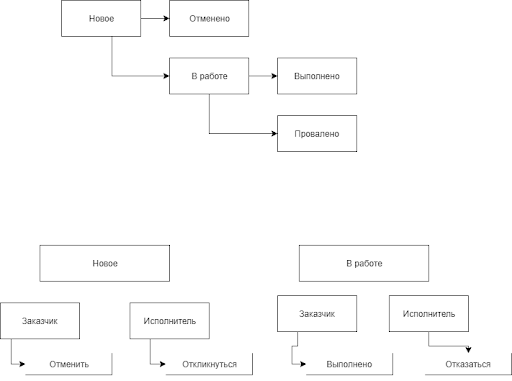

# Техническое задание "TaskForce"

---

## О проекте
«TaskForce» — это онлайн площадка для поиска исполнителей на разовые задачи. Сайт функционирует как биржа объявлений, где заказчики — физические лица публикуют задания. Исполнители могут откликаться на эти задания, предлагая свои услуги и стоимость работ.

Основные сценарии использования сайта:
- Публикация задания;
- Добавление отклика на задание;
- Поиск заданий по категориям и названию;
- Выбор исполнителя и назначение его на задание;
- Редактирование профиля;

### Техническое описание

Для разработки сайта предлагается уже готовая верстка, от программиста требуется лишь написать бэкенд сайта, то есть сделать сайт динамическим, реализовать возможности по добавлению, просмотру заданий и приему откликов.

Разработка бэкенда должна вестись на языке программирования PHP 8, база данных — MySQL 8 и выше.

При разработке схемы базы данных необходимо принимать во внимание какие сущности необходимо хранить, их поля и возможные связи друг с другом.

---

## 1. Технические требования по реализации
Этот документ описывает не только поведение и все функции сайта, но также регламентирует технические детали реализации на уровне кода: используемые возможности фреймворка, необходимые библиотеки и так далее.

### 1.1 Общее
Разработка всего проекта ведётся исключительно на основе фреймворка Yii 2 и его стандартных компонент. Если что-либо (валидация, пагинация, шаблонизация и тому подобное возможно сделать средствами компонент фреймворка, то это **должно быть** сделано этими средствами.

### 1.2 Формы
Любые формы создаются только через компонент ActiveForm. Валидация любой формы выполняется стандартными средствами модели ActiveRecord. По максимуму используются встроенные валидаторы, а для особенных случаев реализуется свой валидатор (standalone либо в виде метода модели).

### 1.3 Авторизация
Все процессы, которые обновляют задания, добавляют отклики и оценки должны выполняться только через компоненты авторизации. Для базового контроля доступа используются ACF-фильтры, для контроля доступа на основе ролей необходимо взять компонент RBAC. Такая авторизация должна проверять, что у пользователя есть право редактировать данный ресурс.
Например, завершать задание может только заказчик.

---

## 2. Описание процессов
Процесс — это автономная операция, выполняющая полезное действие. К примеру: добавление нового комментария или регистрация аккаунта.

### 2.1 Регистрация нового аккаунта
Выполняется после заполнения формы на странице «Регистрация аккаунта».

Последовательность действий:
- Проверить, что отправлена форма
- Убедиться, что заполнены все обязательные поля
- Проверить, что указанный email уже не используется другим пользователем
- Проверить, что выбранный город существует
- Если ошибок нет, то сохранить данные формы в таблице пользователей
- Если были допущены ошибки (не заполнены все поля, email занят и так далее), то не сохранять данные, а показать ошибки в форме под соответствующими полями.

Если данные были сохранены успешно, то переадресовать пользователя на страницу списка заданий.

#### Вход/регистрация через «ВК»

Сайт также предоставляет альтернативный способ авторизации — вход через соц. сеть «Вконтакте». Для этого на форме входа размещается кнопка «Вход через ВК», которая ведёт на oauth сервер соц. сети. Весь дальнейший процесс получения информации о пользователя описан в <a href="https://dev.vk.com/ru/api/access-token/authcode-flow-user">официальной документации</a>.

Если полученный от ВК email пользователя уже существует в БД, то достаточно сохранить для этого пользователя дополнительную информацию и выполнить его аутентификацию. Если пользователя с указанным email нет в БД, то следует его зарегистрировать, используя полученные от ВК данные, а затем выполнить вход.

Важно: пользователь, зарегистрированный через ВК, не имеет пароля, а значит не может поменять его на странице настроек аккаунта.

### 2.2 Публикация нового задания
Страница доступна только аутентифицированным пользователям.
Выполняется после заполнения формы на странице «Добавление задания».

Последовательность действий:
- Проверить, что отправлена форма
- Убедиться, что заполнены все обязательные поля
- Выполнить все проверки для заполненных полей
- Если ошибок нет, то сохранить новое задание в таблице заданий, а прикреплённые файлы перенести в публичную директорию и сохранить ссылки на них.
- При успешном сохранении формы переадресовывать пользователя на страницу просмотра задания.

### Список проверок
##### Проверка категории
Выбранная категория должна существовать в базе данных

##### Локация
При выборе локации пользователь вводит город/район/улицу, а геокодер на стороне клиента подставляет значения (широта, долгота, название города) в скрытые поля формы. На стороне PHP необходимо убедиться, что широта и долгота являются корректными координатами, а название города присутствует в таблице городов.

##### Бюджет
Если заполнено, содержимое поля «бюджет» должно быть целым числом больше нуля

##### Срок исполнения
Если заполнено, содержимое поля должно быть датой в формате ГГГГ-ММ-ДД. Дата не может быть раньше текущего дня.

### Остальные замечания
Вновь созданное задание получает статус «Новое»

Форма задания должна сохранять в БД как идентификатор города (внешним ключом на таблицу городов), так и координаты. ID города нужен для показа объявлений в городе пользователя, а координаты используются для отображения яндекс.карты на странице просмотра задания.

Если поле «Локация» не было заполнено, то задание сохраняется без географической привязки. В этом случае id города и координаты в задании отсутствуют.

### 2.3 Аутентификация на сайте
Выполняется после заполнения формы на странице «Вход на сайт».

Последовательность действий:
- Проверить, что отправлена форма
- Убедиться, что заполнены все обязательные поля
- Найти в БД пользователя с переданным email
- Проверить, что переданный в форме пароль совпадает с сохраненным
- Залогинить пользователя
- После успешного входа пользователь попадает на страницу списка заданий

### 2.4 Добавление отклика
Выполняется после заполнения формы отклика на странице задания.

Последовательность действий:
- Проверить, что роль пользователя «Исполнитель» и он еще не откликался на это задание
- Выполнить проверку значения поля «ваша цена»
- Добавить отклик в таблицу откликов с привязкой к заданию 

#### Проверка цены
Значение поля «ваша цена» должно быть целым положительным числом.

### 2.5 Завершение задания
Выполняется после заполнения формы завершения задания на странице задания.

Последовательность действий:
- Проверить пользователя: завершать задание может только его автор
- Выполнить проверку поля «оценка»
- Сменить статус задания на «Завершено»
- Сохранить новый отклик, в котором текст комментария и значение оценки
- Переадресовать на страницу просмотра задания

#### Проверка оценки
Значение поля «оценка» должно быть целым числом от 1 до 5 включительно

### 2.6 Отказ от задания
Выполняется после нажатия исполнителем кнопки «Отказаться» в модальном окне «Отказ от задания» на странице просмотра.

Отказ меняет статус задания на «Провалено». Данное действие увеличивает счетчик проваленных заданий у исполнителя. Этот счетчик участвует в подсчете рейтинга: он добавляется к общему числу отзывов. Затем следует переадресация на страницу просмотра задания.

### 2.7 Отмена задания
Выполняется после нажатия заказчиком кнопки «Отменить» в модальном окне «Отмена» на странице просмотра.

Последовательность действий:
- Проверить пользователя: отменять задание может только его автор
- Проверить статус: отменять можно только задания в статусе «Новое», т. е. без исполнителя
- Статус задания меняется на «Отменено»
- Переадресовать на страницу просмотра задания

### 2.8 Старт задания
Выполняется после нажатия заказчиком кнопки «Принять» из списка откликов к заданию.

Последовательность действий:
- Проверить пользователя: стартовать задание может только его автор
- Проверить статус: стартовать можно только задания в статусе «Новое», т. е. без исполнителя
- Сменить статус задания: «На исполнении».
- Назначить автора отклика исполнителем этого задания
- Переадресовать на страницу просмотра задания

---

## 3.Список статусов и переходов
Задание может находиться в одном из пяти статусов. Доступные действия над заданием зависят от текущего статуса. Ниже предлагается перечень из всех доступных статусов, возможные переходы между ними и доступные действия на каждом из этапов.

| Статус	 | Описание |
|---------|----------|
| Новое   | Задание опубликовано, исполнитель ещё не найден |
|Отменено	| Заказчик отменил задание |
|В работе	| Заказчик выбрал исполнителя для задания |
|Выполнено | Заказчик отметил задание как выполненное |
|Провалено | Исполнитель отказался от выполнения задания |

</img>

---

## 4. Список всех страниц
Сайт состоит из следующих страниц:

- <a href="#landing">Лендинг</a>
- <a href="#register">Регистрация аккаунта</a>
- <a href="#login">Вход на сайт</a>
- <a href="#tasks">Список заданий</a>
- <a href="#addtask">Добавление задания</a>
- <a href="#viewtask">Просмотр задания</a>
- <a href="#user">Профиль пользователя</a>
- <a href="#settings">Настройки аккаунта</a>
- <a href="#mytasks">Мои задания</a>
- <a href="#modal">Модальные окна</a>

### 4.1 <a name="landing">Лендинг</a>
Эта страница почти целиком состоит из статического контента, который должен находиться в шаблоне страницы.

Исключение составляет блок «последние задания» внизу. Здесь следует разместить карточки четырёх самых новых заданий. Кнопка «Смотреть все задания» ведёт на страницу регистрации.

### 4.2 <a name="register">Регистрация аккаунта</a>
Чтобы пользователь имел возможность добавить на сайт своё задание, либо откликнуться на чужое, ему необходимо пройти процедуру регистрации на этой странице.

Форма состоит из пяти обязательных к заполнению полей и кнопки «создать аккаунт». Форма отправляется методом «POST».

Если по итогам выполнения процесса регистрации возникли ошибки заполнения формы, то эти ошибки должны быть показаны красным текстом под необходимыми полями.

### 4.3 <a name="login">Вход на сайт</a>
Эта страница нужна для показа формы входа на сайт. Оба поля формы обязательны к заполнению.

Страница должна быть доступна только анонимным пользователям. Если на эту страницу попал залогиненный пользователь, то его следует перенаправить на главную страницу.

Если по итогам выполнения процесса возникли ошибки заполнения формы, то эти ошибки должны быть показаны красным текстом под необходимыми полями.

### 4.4 <a name="tasks">Список заданий</a>
Эта страница нужна для показа всех доступных на сайте заданий.
Состоит из двух блоков: карточки задания слева и блок фильтров справа.

Список заданий включает только задания в статусе «Новое». Показываются только задания без привязки к адресу, а также задания из города текущего пользователя.

Время публикации задания выводится в относительном формате вида «минут/часов/дней назад» с округлением в меньшую сторону.

На странице показывается максимум пять заданий. При большем числе записей следует показывать их через пагинацию.

**Блок фильтров**

В правой части страницы находится блок для фильтрации и поиска заданий.
Группа чекбоксов «Категории» выводит все категории, существующие на сайте.

При выборе одной или нескольких категорий выводятся только задания, назначенные этим категориям.

Под заголовком «Дополнительно» находится два чекбокса:

«Удалённая работа» — добавляет к условию фильтрации показ заданий только без географической привязки
«Без откликов» — добавляет к условию фильтрации показ заданий только без откликов исполнителей
Выпадающий список «Период» добавляет к условию фильтрации диапазон времени, когда было создано задание.

### 4.5 <a name="addtask">Добавление задания</a>
Страница для публикации на сайт нового задания. Эта страница доступна только пользователям с ролью «Заказчик».

Требования к формату и валидации полей формы:

#### «Мне нужно»
Обязательное поле. Длина текста: не меньше 10 не пробельных символов.

«Подробности задания» Обязательное поле. Длина текста: не меньше 30 не пробельных символов.

#### «Категория»
Обязательное поле. Выбранная категория должна существовать на сайте.

#### «Файлы»
Поле для выбора одного или нескольких файлов. Задание не обязано содержать прикреплённые файлы. Загруженные файлы могут быть любого формата.

#### «Локация»
Не обязательное поле. Здесь пользователь может добавить географическую привязку к области выполнения задания. При вводе текста следует показывать список автодополнения из geocoder api. При этом дополняемые адреса ограничиваются городом, выбранным у пользователя в профиле (необходимо фильтровать ответ геокодера названием города пользователя). Выбранное значение сохраняется в задании как координаты широты и долготы.

#### «Бюджет»
Не обязательное поле. Должно быть целым положительным числом.

#### «Срок исполнения»
Не обязательное поле. Дата выбирается из всплывающего по клику календарика.

Ошибки валидации формы показываются красным текстом под соответствующими полями.

### 4.6 <a name="viewtask">Просмотр задания</a>
Основные функции этой страницы:
- Просмотр информации задания;
- Добавление отклика;
- Управление статусом задания;
- Выбор исполнителя;
- Добавление отзыва об исполнителе;
- Страница делится вертикально на две части в пропорции 3/1: основной контент и блок для показа чата и карточки исполнителя/заказчика.

#### Основной контент
Начинается с заголовка из названия просматриваемого задания. Под заголовком находится название категории и время публикации в относительном формате. Название категории — это ссылка, ведущая на страницу списка заданий с соответствующим фильтром.

Справа от названия задания отображается выбранный заказчиком бюджет.

Под заголовком «Расположение» находится мини карта, отцентрированная для показа выбранной локации. Справа от карты написано имя города, а под ним подробная информация о расположении, полученная на основе координат через geocoder api.

#### Кнопки статуса
Под общей информацией находится блок для показа кнопок-действий. Набор этих кнопок зависит от роли пользователя и статуса задания (более подробно смотри в разделе «Процессы»). Так, например, у нового задания для роли «Исполнитель» здесь будет кнопка «Откликнуться». Для назначенного исполнителя этого задания будет кнопка «Отказаться» и тому подобное.

#### Отклики

Если у задания есть отклики, то их список выводится под кнопками действий.
Каждый отклик состоит из общей информации и доступных действий.

В информации отклика есть описание пользователя (имя, аватар, рейтинг), предлагаемая стоимость выполнения работы и комментарий.

Для автора задания внутри каждого отклика показаны кнопки для выбора пользователя исполнителем или отклонения его отклика.

Клик по кнопке «Подтвердить» вызывает процесс «Старт задания». Клик по кнопке «Отказать» помечает отклик как отклонённый и больше не показывает кнопки доступных действий для этого отклика.

### 4.7 <a name="user">Профиль пользователя</a>
Страница для показа подробной информации об исполнителе.

Страница предназначена только для показа профилей исполнителей. Соответственно, если этот пользователь не является исполнителем, то страница должна быть недоступна: вместо неё надо показывать ошибку 404.

Верхняя часть основного контента страницы предназначается для краткой характеристики юзера: его имя, аватар, город, рейтинг.

Под заголовком «Специализации» в виде ссылок отображаются выбранные исполнителем категории. Ссылки ведут на страницу списка заданий с фильтрацией по выбранной категории.

#### Рейтинг пользователя
Рейтинг пользователя считается по формуле: `сумма всех оценок из отзывов / (кол-во отзывов + счетчик проваленных заданий)`.

#### Список отзывов
Под блоком с информацией о пользователе находится список отзывов.
Отзывы оставляют заказчики исполнителям по завершению задания. Каждый отзыв состоит из оценки и текстового комментария. Если отзывов у исполнителя нет, то этот блок вместе с его заголовком вообще не выводится.

#### Статистика и контакты
Эти блоки показывают сводную информацию об исполнителе: кол-во выполненных заданий, дату регистрации, место в рейтинге и статус. Место в рейтинге расчитывается так: для каждого исполнителя считается его общий балл, равный среднему арифмитеческому по всем оценкам за выполненные заказы. Статусом может быть либо «Открыт для новых заказов», если пользователь сейчас не занят на активном задании, либо «Занят», если пользователь сейчас выполняет заказ.

Блок с контактами показывается всем, только если у пользователя в настройках не отмечена опция «Показывать мои контакты только заказчику». В противном случае, этот блок будет виден только пользователям, у которых данный исполнитель был назначен на задание.

### 4.8 <a name="settings">Настройки аккаунта</a>
На этой странице пользователь может поменять информацию своего профиля, загрузить/изменить аватар, выбрать свои специализации.

Поля «Имя» и «Email» обязательны для заполнения. Значение поля «День рождения» должно быть валидной датой в формате дд.мм.гггг. Значение поля «Номер телефона» должно быть строкой из чисел длиной в 11 символов. Значение поля «Telegram» должно быть строкой до 64 символов.

В выборе специализаций отмечаются категории заданий, в которых пользователь работает исполнителем.

#### Безопасность
В этой секции можно сменить пароль, а также отключить показ своих контактных данных для всех, кроме заказчика. Для обновления пароля используется три поля: старый пароль, новый пароль и повтор нового пароля. Валидация этих полей производится, если заполнено поле «Старый пароль». Поле «старый пароль» должно быть равно текущему паролю пользователя. Поле «новый пароль» в этом случае обязательно к заполнению, а поле «повтор нового пароля» должно содержать тот-же пароль, что введен в предыдущем поле.

После сохранение формы идет переадресация на страницу просмотра профиля этого пользователя.

### 4.9 <a name="mytasks">Мои задания</a>
Здесь показаны карточки заданий, в которых принимал участие пользователь.
Страница выглядит по разному для роли «Заказчик» и «Исполнитель».

#### Заказчик
Назначение этой страницы — показать все задания, которые создавал этот пользователь.
Меню в левой части страницы отвечает за фильтрацию заданий, в зависимости от их статуса:
- «Новые» — опубликованные задания, на которые не выбран исполнитель
- «В процессе» — задания, которые сейчас находятся в процессе выполнения
- «Закрытые» — задания в статусах «Отменено», «Выполнено», «Провалено»

#### Исполнитель
Назначение этой страницы — показать все задания, на которые откликался этот пользователь.
Меню в левой части страницы отвечает за фильтрацию заданий, в зависимости от их статуса:
- «В процессе» — задания, которые сейчас находятся в процессе выполнения
- «Просрочено» — задания в процессе выполнения, но с истекшим сроком
- «Закрытые» — задания в статусах «Выполнено» и «Провалено»

### 4.10 <a name="modal">Модальные окна</a>
На странице просмотра задания существуют модальные окна, которые вызываются кликом на кнопки-действия.

#### Отклик на задание
Вызывается кликом на кнопку «Откликнуться». Содержит два текстовых поля: «Ваша цена» и «Комментарий». Оба поля необязательны к заполнению. После нажатия кнопки «Отправить» страница перезагружается, а новый отклик добавляется в общий список откликов к заданию.

#### Завершение задания
Вызывается, когда заказчик кликает на кнопку «Завершить». В обязательном поле «Комментарий» заказчик оставляет отзыв о работе исполнителя. Оценка работы выбирается как кол-во звездочек от 1 до 5 и обязательна для выборка.

После нажатия кнопки «Завершить» страница перезагружается, сохраняется новый отклик, а задание переходит в статус «Завершено».

#### Отказ от задания
Вызывается, когда исполнитель кликает на кнопку «Отказаться».
В этом модальном окне есть только поясняющий текст и кнопка «Отказаться». Клик по кнопке «Отказаться» обновляет страницу и меняет статус задания на «Провалено».

---

## 5. Роли пользователей
Анонимные пользователи имеют доступ только к лендингу, странице регистрации и модальному окну входа на сайт.

Пользователи, прошедшие регистрацию и вошедшие на сайт, видят все страницы, доступные для своей роли, кроме страницы регистрации и страницы входа.

Зарегистрированный пользователь может принадлежать одной из двух ролей: Исполнитель или Заказчик. Роль выбирается в процессе регистрации и не может быть изменена позднее.

Заказчики могут публиковать новые задания. Пользователю с ролью «Исполнитель» доступ к странице создания задания должен быть закрыт.

Исполнители могут откликаться на задания, в то время как заказчикам эта возможность закрыта.
